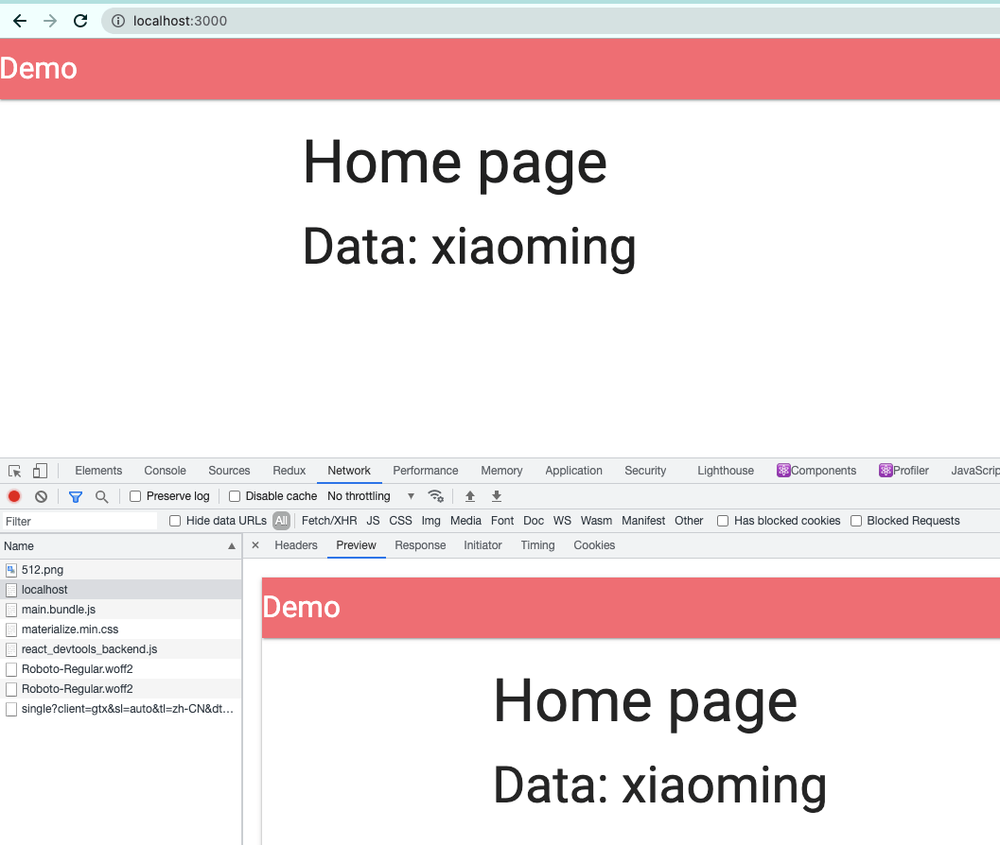

# isomorphic-router-demo


To try out the app:

```
$ git clone https://github.com/lilonghe/isomorphic-router-demo.git
$ cd isomorphic-router-demo
$ npm install
$ npm start
```

Go to [http://localhost:3000](http://localhost:3000) to get the code up and running

To learn more about this repo and what an isomorphic app: [https://hackernoon.com/get-an-isomorphic-web-app-up-and-running-in-5-minutes-72da028c15dd](https://hackernoon.com/get-an-isomorphic-web-app-up-and-running-in-5-minutes-72da028c15dd)  

## Demo


## Motivation

This is a demo project to show you how to set up an isomorphic webapp using [React Router 4](https://github.com/ReactTraining/react-router) and [`react-router-config`](https://github.com/ReactTraining/react-router/tree/master/packages/react-router-config).

The app has a few pages:

1. The Home page, which includes two sets of dynamic loading to server APIs to grab JSON data to be displayed on the page. This is achieved via isomorphic-fetch. One isomorphic-fetch returns the same JSON data every time and the other one returns a different JSON each time.
2. The About page
3. The NotFound page, which gets rendered anytime an unrecognized route is requested.

## App Building Blocks

```
├── build
|  └── main.bundle.js   <=== A2
├── client
|  └── main.js   <=== B2
├── iso-middleware
|  └── renderRoute.js  <=== A4
├── package.json
├── .babelrc
├── .env
├── server
|  ├── run.js
|  └── server.js  <=== A5
├── shared
|  ├── App.js   <=== B3
|  ├── components
|  |  ├── About.js
|  |  ├── HTML.js   <=== A3
|  |  ├── TopNav.js   <=== B4
|  |  ├── Home.js
|  |  ├── Main.js   <=== B5
|  |  └── NotFound.js
|  └── routes.js <=== B6
└── webpack.config.js <=== A1, B1
```

Notes:

* Server Render: **A**  
	* A1. `webpack.config.js` creates `/build/main.bundle.js` when the app is first built.
	* A2. `main.bundle.js` is used in `HTML.js`
	* A3. `HTML.js` is a React component used to generate the template HTML that the server sends to the browser when it gets an HTTP `GET` request from the browser (called the initial load).
	* A4. `renderRoute.js` renders a static version of the `App` (using the `StaticRouter` as a container) into the HTML template in `HTML.js`, converts everything to string using React's server rendering support, then send the final string version of the HTML to send for HTTP GET request.
	* A5. `server.js` responds to the initial load request by getting `renderRoutes` to respond with an HTML.

* Client Render: **B**
	* B1. `webpack.config.js` identifies the entry point for the client app as `main.js`
	* B2. `main.js` renders a SPA version of the app using `BrowserRouter` as container for `App`.
	* B3. `App` includes a `TopNav` and a `Main`.
	* B4. `TopNav` contains React Router `Link` components, which navigates to the route upon click.
	* B5. `Main` contains a React Router `Switch` component, which switches between the `Home`, `About`, and `NotFound` components depending on the route.
	* B6. `routes.js` determines the mapping between routes and the `Home`, `About`, and `NotFound` components.


## Isomorphic Webapp Concepts

* **Initial Load**:  The HTML that server gets an initial request via a HTTP GET request. The server grabs what it needs to render the HTML, such as data from a database or static assets like images, then sends HTML to the browser.
* **SPA mode**: After initial load, the page should immediately enters Single Page Application (SPA) mode. In SPA mode:
	* The app can support quick navigation between pages without refreshing the page, and if done right, can even work offline.
	* Updates are initiated by events, such as mouse clicks or scroll from the user.
	* Additional data can by grabbed by talking to an API. The server serves up data, usually as JSON, to an api endpoint (RESTful API or GraphQL).

## Resources
Here are some repos and tutorials that helped me figure out how to set up the project:

* [technology-ebay-de/universal-react-router4](https://github.com/technology-ebay-de/universal-react-router4/tree/master/src/shared)
* [zacfukuda/universal-app-react-router](https://github.com/zacfukuda/universal-app-react-router)
* [React Router training on server rendering](https://reacttraining.com/react-router/web/guides/server-rendering)
* [isomorphic-dev-js](https://github.com/isomorphic-dev-js/complete-isomorphic-example)
* [EmileCantin's blog](https://blog.emilecantin.com/web/react/javascript/2017/05/16/ssr-react-router-4-webpack-code-split.html)
* Elyse Kolker Gordon's Slides: [SlideShare](https://www.slideshare.net/ElyseKolkerGordon/building-universal-web-apps-with-react-72715124) / [GoogleDoc](https://docs.google.com/presentation/d/1zxF2wvvOxctqqt78ho5D2lCKkU8R2X0wcY_O8TIbVGA/pub?start=false&loop=false&delayms=10000)
* [Going Isomorphic With React](https://bensmithett.github.io/going-isomorphic-with-react/#/) Presentation

## TODOs

- [X] Add `isomorphic-fetch` example to show app grabbing data from an api endpoint while in SPA mode.
- [ ] Add example for redirect with message to the router
- [ ] Add webpack HMR and React Hot Loader
- [ ] Add data preloading example
- [ ] Add redux example
